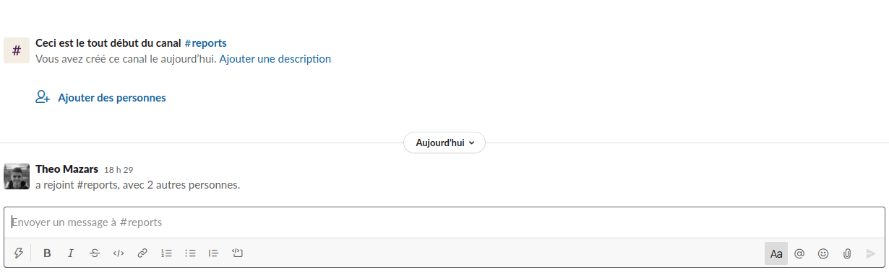

# 🤖 AI Powered Moderation Bot for Slack

This project is what we call a "Hub Experience" in EPITECH. The purpose is to discover something new, explore new technologies and try to learn things that are not in our studies.

With this project I'm discovering the world of the AI and exploring the Perspective API with a simple program that checks if messages are offensive.

## 📃 Prerequisite

1. NodeJS 14
2. Yarn 1.22.10
3. Slack App
4. [Ngrok](https://ngrok.com/) (for local proxy)

## 🏁 Run the project

1. Copy and edit environment: `cp .env.sample .env`
2. Start the proxy: `./ngork http <PORT>`
3. Install dependencies: `yarn`
4. Start the project: `yarn start`

## 🤓 Usage

While typing in channels and sending messages, the bot is checking every message to be sure it's not offensive.

If there's a problem with a message, the bot is adding a skull reaction to inform the user that his message is not respectful.

We can imagine the bot sending messages to a private channel, warning administrators on the server that someone is sending unwanted content.

## 🏷️ Author

- [Theo Mazars](https://github.com/theo-mazars)

## 🔓 License

This project is too simple to use a License. Feel free to reuse the code.